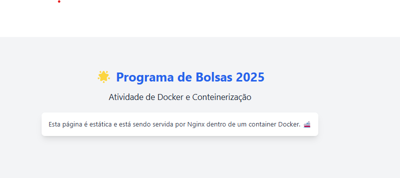

# PB-Compass-Atividade-Docker
 Este repositório contém exercícios sobre containers e Docker, abordando criação, gerenciamento e configuração de containers de forma prática e detalhada.


# 🐳 Programa de Bolsas DevSecOps 2025 – Módulo Docker  

Este repositório contém os exercícios práticos do módulo **Docker e Containers** do **Programa de Bolsas DevSecOps 2025**. Aqui, documentarei todo o processo, incluindo comandos utilizados, desafios encontrados e aprendizados adquiridos ao longo da atividade.  

## 📌 Sobre a atividade  

Este módulo é focado em entender os conceitos fundamentais de **Docker**, desde a criação de containers até sua manipulação e configuração. A atividade prática seguirá um **passo a passo** detalhado, cobrindo tópicos como:  

✔️ Criação e gerenciamento de containers  
✔️ Construção de imagens Docker  
✔️ Uso de Dockerfile  
✔️ Persistência de dados e volumes  
✔️ Networking entre containers  

Toda a documentação e código serão registrados aqui, permitindo que outras pessoas acompanhem e repliquem o aprendizado.  

##  Atividade Docker e Contêinerização

###  1. Criando o container Docker com a imagem do Nginx 🔧

Primeiro, criamos um container com a imagem oficial do **Nginx**, um servidor web popular.

```bash
docker run -dit --name meu-nginx -p 8080:80 nginx
```
### Criando uma página estática simples 🖥️
Criamos uma página HTML simples com conteúdo sobre o Programa de Bolsas 2025 e a Atividade de Docker. Os códigos estaram disponíveis aqui no github.

### Subindo a página no container 🛠️
Agora, subimos o arquivo index.html para o container para que o Nginx possa servi-lo:

```bash
docker run -dit --name meu-nginx -p 8080:80 -v ${PWD}/index.html:/usr/share/nginx/html/index.html nginx
```
Explicação:
- -v ${PWD}/index.html:/usr/share/nginx/html/index.html: Monta o arquivo HTML no diretório do Nginx dentro do container.

###  Acessando a página no navegador 🌐
Agora, basta acessar a página no navegador com o endereço: http://localhost:8080.



###   Personalizando a página
A página foi personalizada com Tailwind CSS e agora exibe informações sobre o Programa de Bolsas 2025 e a Atividade de Docker.

###   Resultado Final
Com isso, conseguimos criar um container Docker rodando o Nginx e servindo uma página estática com conteúdo personalizado. O processo foi simples, rápido e eficiente.

###  Conclusão 📝
Esta atividade demonstrou como utilizar o Docker para rodar um servidor Nginx em um container e servir uma página estática. O uso de Tailwind CSS ajudou a personalizar rapidamente a aparência da página.

## 2. Criando e rodando um container interativo
Inicialmente, foi criado um contêiner Ubuntu, que permite interagir diretamente com o terminal do sistema:
```bash
docker run -it ubuntu
```
### Atualização do sistema:
 Após iniciar o contêiner, o primeiro passo foi atualizar a lista de pacotes disponíveis, garantindo que o sistema estivesse com as últimas versões dos repositórios.

 ### Instalação do pacote **htop**:
  Em seguida, foi realizada a instalação do pacote htop, uma ferramenta que permite monitorar o uso do sistema em tempo real:
  ```bash
  apt install htop
  ```
  ### Execução do htop: 
  Após a instalação, o comando **htop** foi executado para verificar o funcionamento da ferramenta dentro do contêiner.
  
  ### Conclusão
  Esta atividade demonstra de maneira prática como utilizar Docker para criar contêineres e gerenciar pacotes dentro de um sistema Ubuntu. A utilização do **htop** também exemplifica como podemos interagir com o sistema e visualizar informações em tempo real de forma eficiente.

